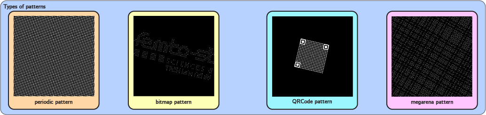
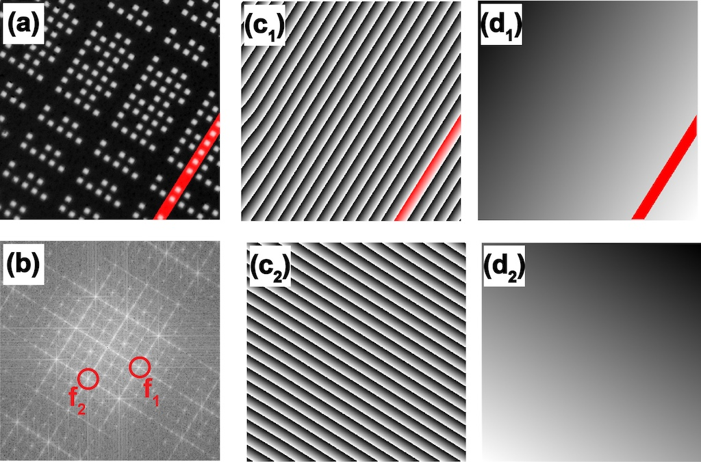
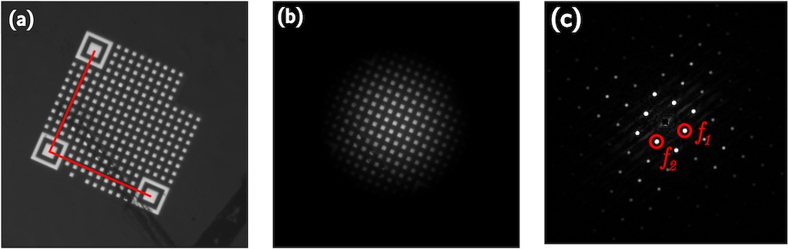
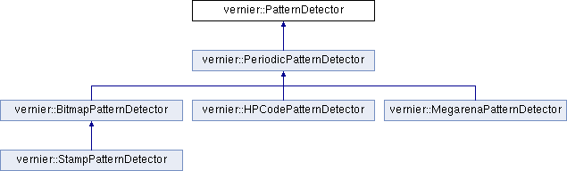
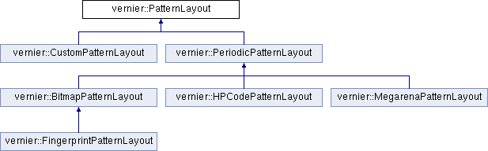
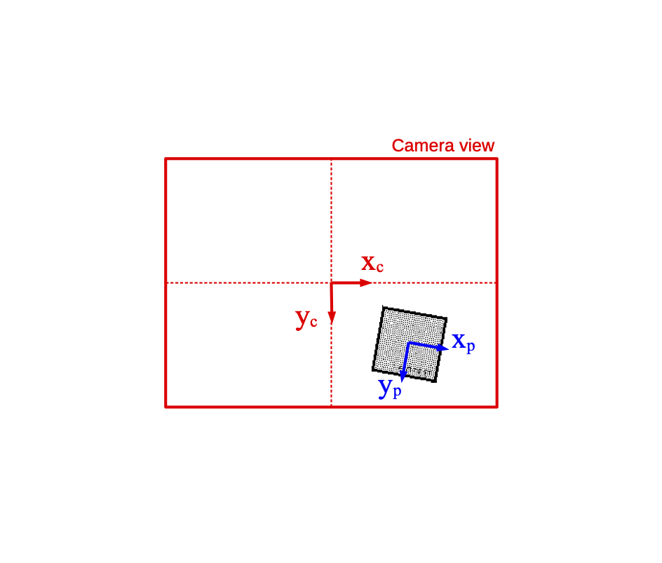
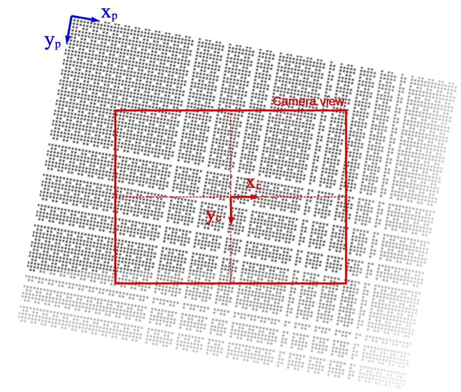
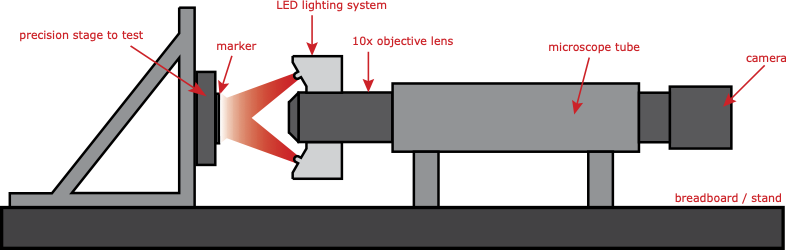

The `VERNIER` Library is an open-source C++ library for pose measurement of calibrated patterns with subpixel resolutions.

The library defines a collection of classes for detection and rendering different kind of calibrated patterns (periodic patterns, megarena patterns, QR-code-like and stamps patterns).

 

`VERNIER` covers a wide range of applications requiring pose estimation at small scales and is off-the-shelf available to be easily used on these applications. Megarena patterns provide measurements with high range-to-resolution ratios for stages metrology, manipulators automation and correlative microscopy. On the other hand, HP code and Stamp markers can be used to obtain the relative position of multiple fiducial markers in the same image for assembly and force measurement.  

## Measurement principle

The pose estimation combines two complementary steps; i.e. a coarse but absolute one and a fine but relative one. The fine measurement principle ensures the high resolution of the method that is typically of a few $10^{-3}$ image pixel. It relies on Fourier transform and phased-based measurements after spectral frequency filtering. The successive processing steps are depicted below:



The acquired image (a) is first transferred to spectral domain through Fourier transform and the periodic frame of dots will result in sharp spectral peaks (b). A Gaussian band-pass filter is then applied to each spectral lobe $f_1$ and $f_2$ to retrieve their frequency and phase information independently without loss of information. 
Applying an inverse Fourier transform to the two selected spectral lobes yields two wrapped phase maps (c), which can be unwrapped to obtain two phase planes (d) that are representative of the dot positions with respect to the image pixel frame. Data averaging over the whole detected area ensures noise rejection and high resolution. However, a $2k\pi$ (with $k$ an entire number) phase ambiguity remains since the unwrapping process depends on the starting pixel chosen. This ambiguity is resolved through further absolute decoding. 

Each period of dots corresponds to a phase excursion of $2\pi$ that can be easily identified from the unwrapped phase maps. The in-plane orientation of the dot pattern is also provided by the unwrapped phase map equation obtained through least square plane fitting. 

The coarse but absolute position detection principles differ for the small and large marker types. For small markers, we used existing robust detection methods provided by the OpenCV library; i.e. QR code detection for HP code markers (as shown below) and quadrilateral detection for Stamp markers. The detection of the marker contours allows the resolution of the $2k\pi$ phase ambiguity and results leading to the fine and absolute pose estimation within the image. 



For the Megarena pattern, a robust phase-based binary decoding procedure has been developed that computes a local adaptive threshold for discriminating between present and absent dots. We thus reconstruct two binary sequences, one for each direction of the pattern, that allows the univocal determination of the position of the area observed with respect to the top-left corner of the whole Megarena pattern. % as shown in Figure~\ref{fig.frames}. 
A complete presentation of the position decoding method can be found in~\cite{andre2020robust}.

This measurement principle is mainly suited for in-plane 3 DoF pose estimation under microscopy orthographic projection. However, long-focal  perspective projection can be used for retrieving complementary out-of-plane pose parameters with a lower resolution. Full out-of-plane pose estimation details and performances can be found in~\cite{andre2022pose}. 


## Library Structure

The overall library is thought to be simple to use and relies on class hierarchies. 
This allows to use the same functions to detect (or render) any kind of patterns. 

The library is composed of two main distinct branches which are:

- Pattern detection (for pose estimation)
- Pattern generation (for image rendering and layout exporting)

Different types of patterns are available in both branches.

The class hierarchies for the detection of patterns are presented in the figure below:


 

The class hierarchies for the rendering of patterns are presented in the figure below:




Two class factories enable to create detectors or renderers from a JSON filename given as an input to the class. 

All the JSON files must have the right entries to describe a pattern. Here is the example of a JSON file for a periodic pattern:

```
{
    "PeriodicPattern": {           // name of the pattern class
        "description": "Pattern created with Vernier library",
        "date": "2020",
        "author": "FEMTO-ST",
        "unit": "micrometer",      // unit of the pattern period
        "margin": 0.0,
        "period": 20.0,            // wave length of the physical pattern
        "nRows": 137,              // number of rows of the pattern
        "nCols": 137,              // number of columns of the pattern 
        "copyright": "Copyright (c) 2018-2023 ENSMM, UFC, CNRS."
    }
}
```

## Frame definition 

 



## Setup Guidelines

Since the pose estimation method is based on the analysis of the pattern image spectrum, the number of periods appearing on the image affects the sharpness of the spectral lobes, and hence the resolution of the measure. In [andre2022automating], we studied the effect of the number of HP code periods over the resolution. It appears in ideal conditions that viewing a minimum of 17 periods is required to achieve 0.001 pixel resolution for translations and 0.1 mrad for rotations (around Z axis). However in real conditions, a larger number of periods will provide a greater robustness against occlusion and other disturbances of the image. By experience, 20 to 30 periods is a good choice for HP code and Stamp markers. 
In the case of Megarena patterns, the minimum number of periods to have in the field of view is determined by the depth of the absolute position code. For a $n$ bits pattern, $3(n+1)$ visible periods are required at minima.

The second requirement to achieve best results is that the apparent size of a period in the image should be between 7 and 15 pixels. Therefore, given the magnification of the lens and the pixel pitch of the sensor, it is easy to retrieve the physical size of the period to obtain this apparent size. Conversely, it is possible to choose an optical setup knowing the physical size of the period. 
If robustness against blur is important for the targeted application, a larger period is more suitable since a lower spectral frequency will be cut at an increased defocus distance. Furthermore, larger periods allow the choice of lower lens magnifications, with lower numerical apertures and increased depths of focus, making the measure more robust against defocus.

Once the magnification and pattern design have been set, we showed in [andre2020robust] that the most influential parameter on the resolution is the dynamic range of the image. Best results are obtained with 12-bits sensors with a high contrast between the black background and the white dots. However, image saturation must be avoided to keep the imaging of dot edges as linear as possible. Moreover in case of moving targets, a sensor with global shutter is essential to avoid any motion bias.

Finally, nanoscale measurements require additional precautions to avoid drifts and vibrations. To reach a low level of mechanical disturbances, the setup must be mounted onto a heavy stand placed on an anti-vibration table like any coordinate measuring machine. It is preferable to place the microscope tube flat on the stand.   
Other uncertainties, such as thermal drift, can be mitigated by placing the system in a metrology room where the temperature and humidity are controlled. Then, the main remaining source of uncertainty comes from the heating of the camera. A long warm-up of the camera must be performed before measurements. These guidelines are summed up in [Mauze2020visual].



