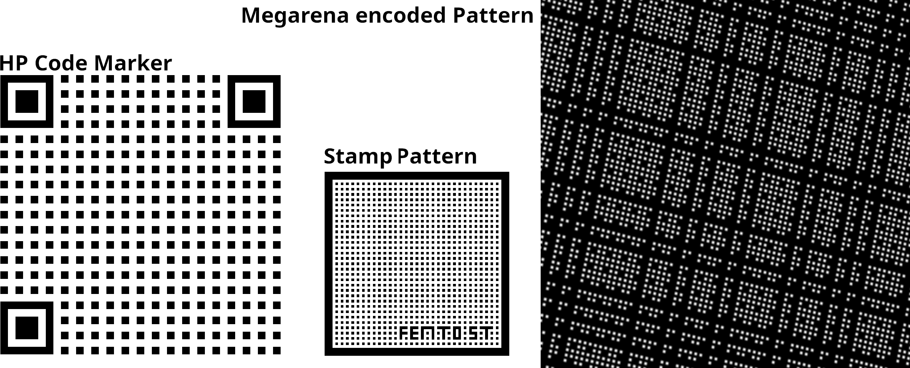

# Summary

At the small scales, few solutions exist to capture the pose of an object with nanometric and microradian resolutions over relatively large ranges. Over the years, we have proposed several fiducial marker and pattern designs to achieve reliable performance for various microscopy applications. `VERNIER` is an open source phase processing library designed to provide accurate pose measurement based on these results. Centimeter ranges are possible using binary encoding methods, while nanometer resolutions can be achieved using phase processing of the periodic patterns. Moreover, the detection has proven to be particularly robust to noise, defocus and occlusion thanks to a local thresholding algorithm based on the phase. The paper presents the measurment principles and the patterns implemented in `VERNIER` addressing different application needs.

# Statement of need

The `VERNIER` library provides a powerful tool to measure the 2D and 3D poses of objects observed through a microscope lens with unprecedented sub-pixel resolutions and ranges. The library works in combination with markers fixed on the objects of interest, allowing accurate measurements even in noisy and blurred imaging contexts which commonly occurs in the microscopy context. The image processing involves two complementary steps, resulting on the one hand in fine but relative position measurement and, on the other hand, a coarser but absolute localization. The fine position process achieves high sub-pixel resolutions thanks to spectral analysis of the imaged periodic pattern of the marker. Complementary coarse measurements are retrieved either from the marker contours or from a binary sequence encrypted within the pattern.

`VERNIER` works with three different types of markers, designed to meet different application requirements, and whose design can be easily adapted to specific imaging parameters, mainly magnification, field of view (FoV), and expected measurement range and resolution (cf. \autoref{fig:MarkerTypes}.). 
Sources and layouts are available on [GitHub](https://github.com/vernierlib/vernier) and can be downloaded for evaluation and testing. 

{ width=80% }

# State of the field                                                                                          
Computer vision is widely used to track the movement of people and objects in many applications. When the size of the object of interest decreases, pose estimation becomes challenging due to the constraint of microscopy imaging. Unlike regular cameras, microscopes suffer from narrow FoV, short depths of field, low contrasts and out-of-focus blurs, and usual fiducial markers perform poorly in these conditions.                   

Many vision-based methods have been proposed to tackle pose estimation at the small scales. In 2021, Fatikow published a review paper comparing the resolution and the range of state-of-the-art vision-based localization methods [@yao2021review]. The most precise methods use phase correlation and can achieve sub-nanometer resolutions. However, their measurement ranges are still limited by the microscope's FoV. To overcome this limitation, pseudo-periodic patterns can be used to encode the absolute position over centimetric ranges, while using phase measurement to achieve nanometer resolutions [@andre2020sensing; @andre2020robust]. 
Based on this principle, `VERNIER` proposed processing algorithms for several markers and patterns that ensure reliable performance in various microscopy applications. This approach outperforms all others in terms of range-to-resolution ratio [@yao2021review].  

The measurement principle is mainly suited for in-plane 3 degrees of freedom (DoF) pose estimation under microscopy orthographic projection. However, long-focal  perspective projection can be used for retrieving complementary out-of-plane pose parameters with a lower resolution. Full out-of-plane pose estimation details and performances can be found in [@andre2022pose]. 

To achieve the measurement of the 6 DoF, the same approach is applied but with a digital holographic microscope (DHM). The interferometric character of DHM makes the device highly sensitive to out-of-plane motion and the 6 DoF are measured simultaneously in a single image with a high resolution [@ahmad2024-6DoF]. 

\autoref{fig:features} presents the mean features and metrics of the pose estimation of all marker types. All the metrics have been validated experimentally with precision stages and robots [@andre2020sensing; @andre2020robust; @andre2022pose; @ahmad2024-6DoF].

# Software design

`VERNIER` is written in `C++` and defines a collection of classes for detection and estimating the pose of three kinds of calibrated patterns (Megarena patterns, HP code and Stamp markers). The library is cross-platform. The users can build the examples and unit tests using `CMake`. The library relies on multiple third parties: `OpenCV`, `Eigen`, `FFTW`, `MatIO`, `RapidJSON` and `GDS Tool Kit`.

The library also provides a set of classes for rendering synthetic images and exporting layouts of the different markers presented in previous section. The synthetic images are used to test the correct functioning of the detectors. The marker layouts can be exported in `PNG`, `SVG`, `GDS` and `OASIS` formats. These files can be used to print the markers on various supports.

As the measurement method is based on the phase of the periodic pattern, the position accuracy is directly related to the scale and quality of the pattern fabrication. 
To obtain calibrated measures, all the patterns have been realized using a high-resolution maskless aligner (Heidelberg MLA150) on quartz or glass substrates within the [MIMENTO facility](https://platforms.femto-st.fr/centrale-technologie-mimento/). 

# Research impact statement

`VERNIER` has found many applications in microrobotics as presented in \autoref{fig:applications}.

#### Metrology of precision manipulators

One of the major interest of Megarena patterns is to perform the metrology of micro and nano stages and precision manipulators. Indeed, few solutions to measure the 3D pose of the manipulator end-effector at the nanoscale are available. The laser interferometers provide a very high range-to-resolution ratio of approximately 10^9^ but only along the laser's axis. Setups with several interferometers have demonstrated multiple DoF measurement systems [@lee2011design; ortlepp2024high], at the expense of occupied volume and calibration complexity. 
Moreover, due to the constraints of laser reflection, the range of their angular measurements is very low, not exceeding a magnitude of one milliradian.

The use of Megarena patterns is much simpler and also provides nanometric resolution and centimeter ranges. Moreover, using a DHM, the angular ranges of out-of-plane rotations reach 0.2 rad with resolutions down to 0.1 µrad. 
The ideal setup consists only of a microscope and a piece of a Megarena pattern attached to the end effector of the manipulator. 

For example, the method has been used to evaluate the accuracy of a precision hexapod, showing that it is able to follow millimeter trajectories with deviations of less than one micrometer [@ahmad2024-6DoF]. It has also been employed to evaluate the accuracy of a serial 6-DoF manipulator over a point matrix of 10 by 10 centimeters [@andre2020sensing]. 
Megarena patterns can also be used to measure the repeatability of positioning of stages and manipulators. For instance, in [@Gallardo2021turning; @Mauze2020nanometer], the method is used to evaluate the precision of parallel continuum robots.

Beyond stages and manipulators metrology, the method could also be useful for measuring the deviation of CNC machines and vision measuring machines.

#### Multi-DoF stage automation

The Megarena patterns can also be used as position sensor to directly control the position of the motion platform of a multi-DoF manipulator during its operation. This ensures the actual position of the end-effector regardless of the errors introduced by assembly of stages, guidance, compliance, and backlash in the mechanical axis. It could also help to identify and correct cross-axis coupling and unwanted motion in multi-DoF systems, as proposed in [@Tan2015accuracy]. 

As no internal additional sensors are required, pattern-based direct measurement can be applied to an existing manipulator to improve its accuracy and to carry on precision tasks such as micro-assembly. 

#### Micro-assembly

Micro-assembly requires two parts to be positioned relatively to each other with high precision. To make assemblies with errors lower than a micrometer, the joint sensors of the manipulators are not sufficient and it is necessary to use visual servoing to control the relative position of the parts. To that extent, markers are placed on each of the parts to assemble and their relative position is monitored in real time during the assembly process. 
In [@andre2022automating], two HP code markers are used to align and bond two parts of a microfluidic chip. This automated assembly achieved a positioning accuracy of better than 50 nm.

Beyond this assembly example, HP code and Stamp markers could also be useful for wafer alignment in photolithography processes, die assembly in the semiconductor industry, and stitching in high-resolution 3D printing and laser processing.

#### Micro-force measurement

Another key application in microrobotics is simultaneous force and displacement sensing. Force sensing has always been an issue for micro- and nanoscale applications. Force ranges from a few mN to a few hundred mN are typically required for manipulation, assembly and characterization tasks in most fields.

In [@andre2022automating], two HP code markers have been attached to a compliant mechanism. The relative motion between the markers gives an image of the compression force, while the relative position of the markers to the camera frame gives the displacement of the mechanism base. This force sensor has been used experimentally to perform automated compression tests on individual synthetic and natural fibers, providing very rich information and allowing to better understand the mechanical fiber behavior  [@govilas2024mechanical].

Previous experiments with this method have shown resolution measurements down to 50 nN with experimental ranges of 50 mN  [@Guelpa2015vision]. The same principle has also been applied to multiple directions force sensing in  [@Tiwari2021high].

#### Correlative Microscopy

The pattern-based position measurement was initially developed to perform the repositioning of Petri dishes under a microscope for live cell monitoring  [@galeano2011position]. Thanks to a pattern similar in principle to the Megarena, regions of interest of a culture dish were easily retrieved after transfers from a cell incubator to the microscope stage. Thanks to this approach, images of single cells can be captured at different time steps in a repeatable manner, as the cells can be identified based on their absolute position in the Petri dish.

In this way, Megarena patterns could also be used in correlative microscopy, to retrieve the position of the very same cell or tissue area and image it with various modalities (e.g. electron, confocal, fluorescent microscopes).

# AI usage disclosure

No generative AI tools were used in the development of this software, the writing of this manuscript, or the preparation of supporting materials.

# Acknowledgements

This work has been supported by the ANR project Holo-Control (ANR-21-CE42-0009) and by the Bourgogne-Franche-Comté Region (Nano6D). It has been achieved in the frame of the EIPHI Graduate School (ANR-17-EURE-0002). The encoded targets were realized thanks to the RENATECH technological network and its FEMTO-ST facility MIMENTO. The experiments were conducted within the ROBOTEX network (ANR-21-ESRE-0015) and its FEMTO-ST technological facility CMNR.

# References

